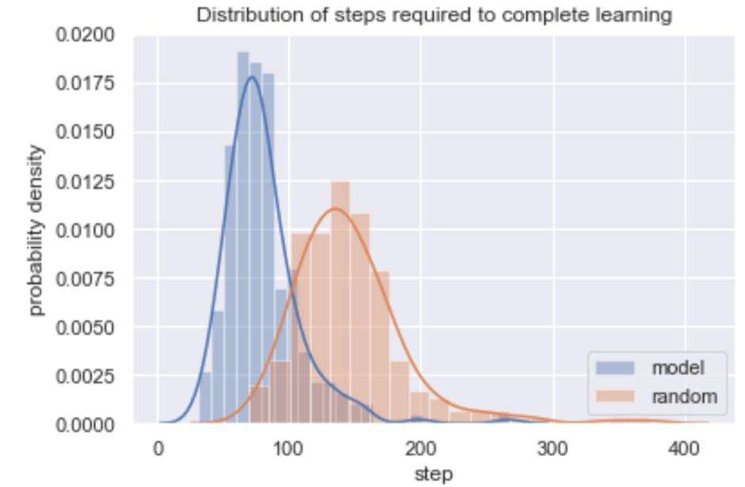
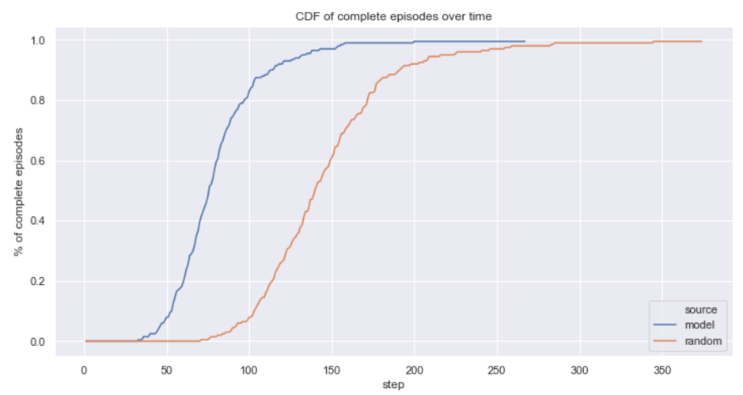
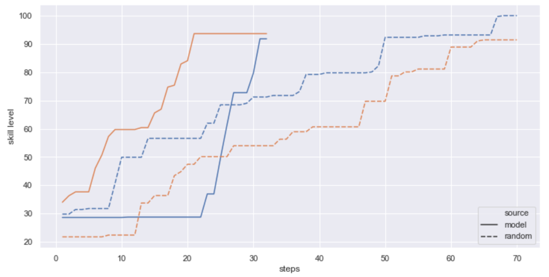
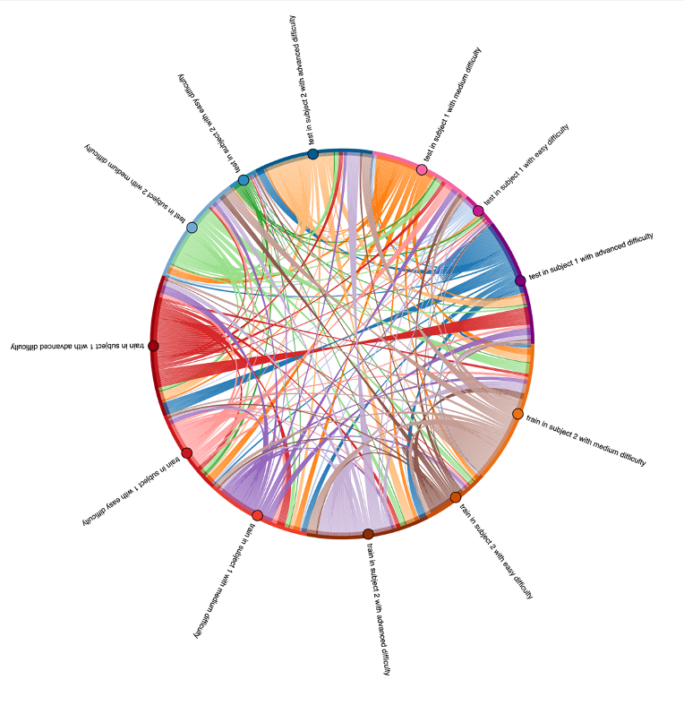
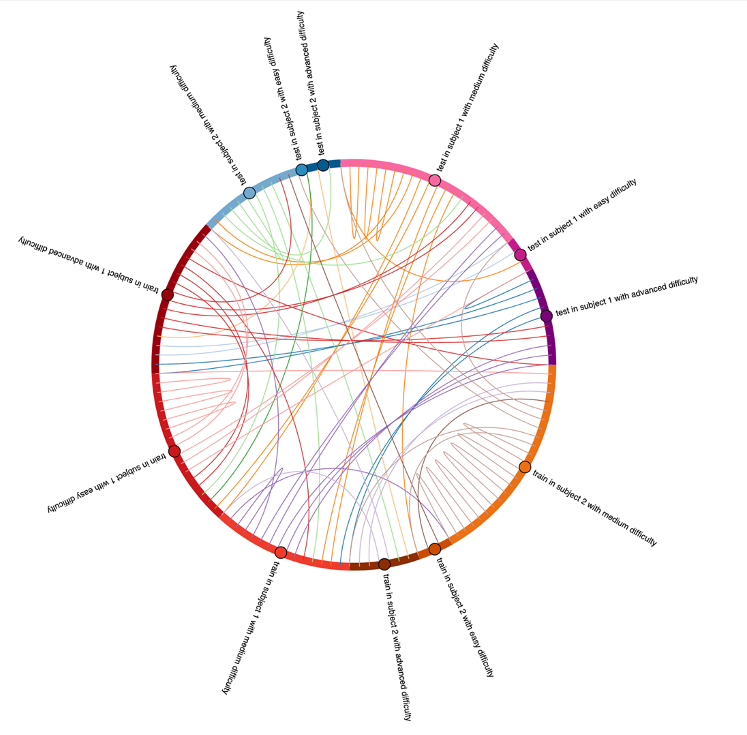
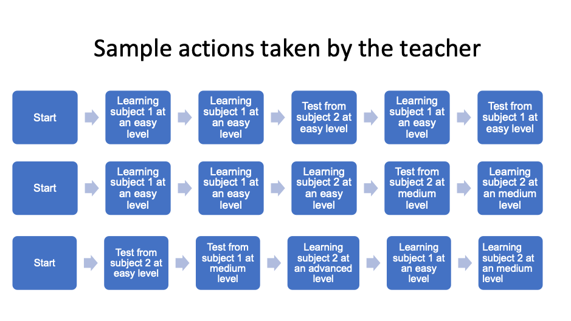
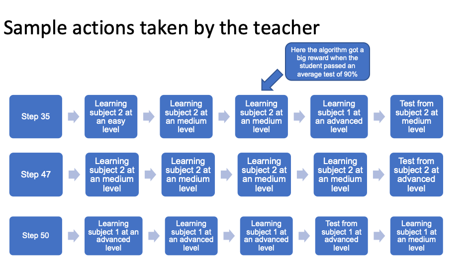

# hackyeah2020 - YourTutor

RL approach to optimization of teaching process with respect to individual student's capabilities.

## Some results

*Histogram of difference in time completion of learning task by random algorithm and our model (evaluated on 200 examples/artificial students)*
\
\
\

*Cumulative distribution function of difference in time completion of learning task by random algorithm and our model (evaluated on 200 examples/artificial students)*
\
\
\

*Different learning path (showing progress in learning level of student) for the quickest runs in simulation (evaluated on 200 examples/artificial students) with division of two subject to learn*
\
\
\

*Flow of decision made by trained teacher model – each links represents following decision (aggregated for 100 runs/examples/artificial students)*
\
\
\

*Flow of decision made by trained teacher model for one student. Each links represents following decision*
\
\
\

*Sample actions of teacher from beginning*
\
\
\

*Sample actions of teacher in the middle of process*
